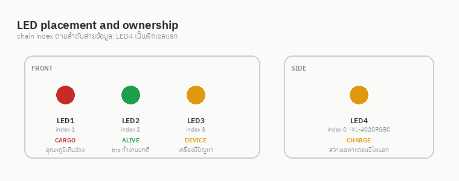
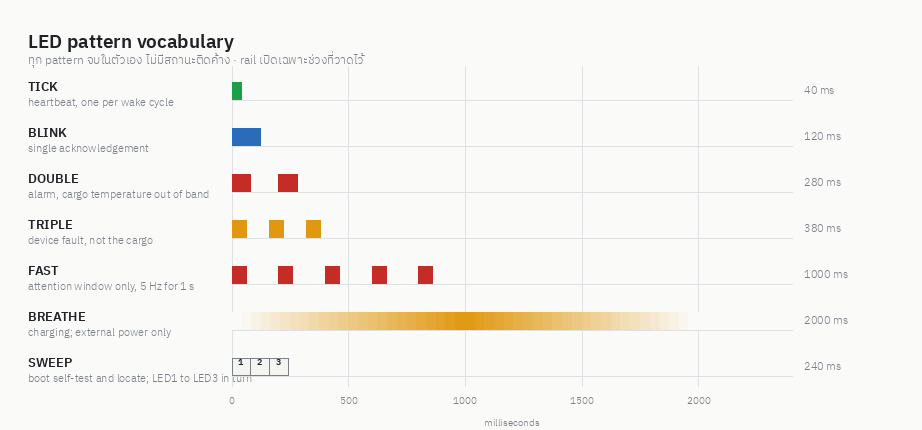

# mCOLD — LED design

4 addressable RGB pixel · ภาพประกอบอยู่ที่ `led-mock/out/` สร้างด้วย `python led-mock/patterns.py`

## Hardware ที่ต้องยึด

| รายการ | ค่า |
|---|---|
| Chain order | index0 = **LED4** XL-4020RGBC-2812B · index1–3 = **LED1/2/3** SK6812MINI-E |
| Data | GPIO43 (pad TXD0) ต้องใช้ RMT หรือ driver ที่คุม timing |
| Power | GPIO48 → Q1 AO3401A P-MOS · **LOW = เปิด rail, HIGH = ปิด** |
| Rail | 3V3_LED แยก ปิดได้ทั้งก้อน |

[ASSUMPTION ต้องยืนยันกับแบบกลไก/PCB] **LED4 คือดวงที่อยู่ข้างเครื่อง** เพราะเป็น part ต่างจากอีกสามดวง
(XL-4020RGBC ตัวเดียว ส่วน LED1/2/3 เป็น SK6812MINI-E เหมือนกันหมด) และเป็นพิกเซลแรกของสาย
ถ้าจริง ๆ LED4 อยู่หน้าเครื่อง ต้องสลับ index ในตาราง ไม่ใช่สลับสาย

## กฎข้อเดียวที่สำคัญที่สุด: rail เปิดเฉพาะตอนกระพริบ

ชิป addressable LED กินไฟแม้ดับ (quiescent ~1 mA/ดวง [VERIFY ต้องวัด]) สี่ดวงรวม ~4 mA
ซึ่งเกิน budget ทั้งก้อนของเครื่อง (เป้า 7 วันเหลือเฉลี่ยได้ ~7.14 mA)

| แบบ | พลังงาน 7 วัน | คิดเป็น |
|---|---|---|
| เปิด rail ค้างไว้เฉย ๆ | **~672 mAh** | เกินครึ่งของแบต 1500 mAh — ทำไม่ได้ |
| TICK เขียวทุกรอบตื่น 300 s | ~0.22 mAh | 0.02% |
| DOUBLE แดงทุกรอบตื่น 300 s | ~1.5 mAh | 0.13% |
| attention window 20 ครั้ง/วัน | ~4 mAh | 0.35% |

ประมาณการทั้งหมด [VERIFY] · สรุปคือ **ตัวกระพริบไม่ใช่ต้นทุน ต้นทุนคือการเปิด rail ค้าง**
เอกสาร requirement §12 profile 1 เขียนว่า "LED off" ระหว่าง TRIP_OFFLINE_LOW_POWER —
การกระพริบ 40 ms ทุก 300 s ถือว่าอยู่ในเจตนานั้น แต่ต้องวัดจริงยืนยัน

### ผลพลอยได้ที่กันปัญหาไว้ล่วงหน้า

GPIO43 คือ pad **TXD0** ซึ่ง ROM bootloader พิมพ์ log ออกมาทุกครั้งที่บูต/ตื่นจาก deep sleep
ก่อน application จะทำงาน ข้อมูลนั้นจะวิ่งเข้า chain เป็น bit สุ่ม → ถ้า rail เปิดอยู่
LED จะติดสีมั่วทุกครั้งที่ตื่น การตั้ง log level ของ application ไม่ได้แก้ waveform ของ ROM
**rail ต้องปิดเป็นค่าเริ่มต้นและต้องตั้ง GPIO48 hold ให้คง HIGH ข้าม deep sleep**
ข้อมูลสุ่มจึงไม่มีไฟไปจุด

## Pattern vocabulary

| Pattern | เวลา | ใช้กับ |
|---|---|---|
| TICK | 40 ms | heartbeat "เครื่องยังทำงาน" |
| BLINK | 120 ms | ตอบรับคำสั่งครั้งเดียว |
| DOUBLE | 280 ms | alarm ของสินค้า |
| TRIPLE | 380 ms | ปัญหาของเครื่อง |
| FAST | 1000 ms (5 Hz) | ในช่วง attention window หรือก่อนดับเพราะแบตหมด |
| BREATHE | 2000 ms วน | กำลังชาร์จ — ใช้เฉพาะตอนมีไฟนอก |
| SWEEP | 240 ms (LED1→2→3) | boot self-test และ locate |

ทุก pattern **จบในตัวเอง ไม่มีสถานะติดค้าง** เอกสาร requirement ห้าม LED ติดสว่างค้างตลอดการขนส่ง
ข้อยกเว้นเดียวคือ LED4 ตอนเสียบไฟนอก ซึ่งไม่กินแบต

brightness cap เริ่มที่ **20%** [PROPOSED config ได้] · ห้ามกระพริบ LED พร้อม buzzer
เพราะ buzzer coil 16 Ω ดึง peak ~200 mA อยู่แล้ว ให้เล่น pattern เสียงกับไฟสลับกัน ไม่ทับกัน

## หน้าที่ของแต่ละดวง

แต่ละดวงเป็นเจ้าของความหมายเดียวถาวร ไม่สลับหน้าที่ตาม state จึงไม่ต้องมี arbitration ระหว่างดวง

### LED1 — CARGO (แดง) "สินค้ามีประเด็น"

| เงื่อนไข | Pattern |
|---|---|
| อุณหภูมิเกินช่วงใน trip (alarm latched) | DOUBLE แดง |
| ประตูเปิดค้างเกินเกณฑ์ | DOUBLE แดง |
| มีการกระแทกที่เกินเกณฑ์ใน trip นี้ | DOUBLE แดง |
| ผู้ใช้ ack alarm จากแอป | BLINK น้ำเงินครั้งเดียว แล้วกลับไป DOUBLE ถ้าเงื่อนไขยังค้าง |
| ไม่มี alarm | ไม่ติด |

สามเงื่อนไขแรกใช้ pattern เดียวกันโดยเจตนา — คนอ่านจังหวะกระพริบแยกสาเหตุไม่ได้อยู่แล้ว
สิ่งที่ LED ต้องบอกคือ "หยิบแอปมาดู" ส่วนสาเหตุอยู่ในแอป จอ และ log
`ack` ไม่ลบประวัติ alarm ตามข้อกำหนด และไม่ดับไฟถ้าเงื่อนไขยังเป็นจริง

### LED2 — ALIVE (เขียว) "trip ทำงานปกติ"

| เงื่อนไข | Pattern |
|---|---|
| START_TRIP สำเร็จ | TRIPLE เขียว (ยืนยันให้คนกดเห็น) |
| trip ทำงาน บันทึกข้อมูลได้ปกติ | TICK เขียว 1 ครั้ง/รอบตื่น |
| STOP_TRIP | BLINK เขียว แล้วดับ |
| ไม่มี trip | ไม่ติด |

TICK คือหลักฐานเดียวที่บอกว่าเครื่องยังเก็บข้อมูลอยู่ — ภาพบนจอ e-paper ค้างได้แม้ไฟดับ
จึงใช้ยืนยันไม่ได้ ไฟดวงนี้ยืนยันได้

### LED3 — DEVICE (เหลืองอำพัน) "เครื่องมีปัญหา ไม่ใช่สินค้า" [PROPOSED]

| เงื่อนไข | Pattern |
|---|---|
| probe หลุด/ไม่มี sample, RTC ไม่ตรง, sensor bus error, display fault | TRIPLE เหลือง |
| flash error/recovery, storage เต็ม, ข้อมูลถูกทิ้ง, SD ผิดพลาด | TRIPLE เหลือง |
| self-test ไม่ผ่าน, reset ที่ไม่ได้ตั้งใจ (watchdog/brownout) | TRIPLE เหลือง |
| แบตต่ำ | TRIPLE เหลือง |
| แบตวิกฤต ก่อนหยุดบันทึก | FAST เหลือง 1 ครั้ง แล้วดับทั้งหมด |
| GNSS ไม่มี fix | ไม่ติด (ในอาคารเป็นเรื่องปกติ ตามที่เอกสารระบุ) |
| ปกติ | ไม่ติด |

**นี่คือดวงที่สามที่ยังคิดไม่ออก ผมเสนอ DEVICE เพราะ** มันแยก "ปัญหาของสินค้า" (LED1)
ออกจาก "ปัญหาของเครื่อง" (LED3) ได้คมที่สุด — คนรับกล่องตัดสินใจต่างกันสองแบบ:
LED1 ติด = ของอาจเสียหาย ต้องตรวจ · LED3 ติด = ของน่าจะโอเค แต่หลักฐานไม่ครบ ต้องส่งซ่อม

ทางเลือกอื่นถ้าไม่เอา DEVICE:

| ทางเลือก | ได้ | เสีย |
|---|---|---|
| **LINK/CLOUD** (น้ำเงิน = ส่งขึ้น server ครบ, กระพริบ = มี backlog) | เห็นสถานะที่ไม่มีทางรู้จากที่อื่น จอก็อัปเดตทุก 15 นาที | ปัญหาของเครื่องจะไม่มีไฟบอกเลย |
| **SHOCK latch** (แดง/ขาว ค้างไว้ทั้ง trip) | คนรับเห็นทันทีว่ากล่องถูกกระแทก | ซ้ำกับ LED1 และไฟค้างกินพลังงาน |
| ปล่อยว่างไว้ | ประหยัดที่สุด | เสียพิกเซลที่ติดมาบนบอร์ดแล้วไปฟรี ๆ |

### LED4 — CHARGE (ข้างเครื่อง) — สว่างเฉพาะตอนมีไฟนอก จึงไม่กินแบต

| เงื่อนไข | Pattern |
|---|---|
| ชาร์จเร็ว (ก่อนถึงเกณฑ์ taper) | BREATHE เหลือง |
| ชาร์จช้า/taper (≥80%) | BREATHE เขียว |
| ชาร์จเต็ม | ติดเขียวค้าง |
| มีไฟนอกแต่ไม่ชาร์จ (CE ปิด / อุณหภูมิ / policy) | BLINK เหลืองช้า ๆ ทุก 2 s |
| charge fault | BLINK แดงทุก 1 s |
| ไม่มีไฟนอก | ไม่ติด |

## จังหวะกระพริบตามสถานะพลังงาน

ไฟจะมีประโยชน์ก็ต่อเมื่อคนอยู่ตรงนั้นตอนมันกระพริบ — กระพริบทุก 300 s แล้วคนยืนรอ 5 นาที
ไม่ช่วยอะไร แต่กระพริบทุก 2 s ตลอดเวลาก็หมดแบต ทางออกคือ **attention window**

| สถานะ | จังหวะ | พลังงาน |
|---|---|---|
| battery + trip (หลับอยู่) | 1 pattern ต่อรอบตื่น 300 s | ~1.7 mAh/7 วัน |
| **attention window 30 s** (ประตูเปิด / NFC tap / เครื่องขยับ) | 1 Hz ใช้ light sleep ระหว่างจังหวะ | ~0.03 mAh/ครั้ง |
| BLE / USB session | 1 Hz ตลอด session | session เองกินมากกว่าไฟอยู่แล้ว |
| มีไฟนอก / อยู่ใน Dock | 1 Hz + LED4 BREATHE | ไม่กินแบต |
| แบตวิกฤต | FAST 1 ครั้ง แล้วดับทุกดวง | — |
| HARD_OFF (SW3) | ไม่มีไฟ firmware ไม่ทำงาน | — |

ประตูเปิดคือ wake source อยู่แล้ว (GPIO7) และแปลว่า "มีคนกำลังจับกล่องนี้" จึงเป็น trigger ที่ดี
แต่เอกสารเตือนเรื่องประตูเปิดค้างทำ wake storm ดังนั้น **จำกัด attention window
ไม่เกิน 4 ครั้ง/ชั่วโมง** และไม่เปิดซ้ำถ้าประตูยังค้างเปิดจากครั้งก่อน

## ไฟตาม event

ทุก event ที่ไม่อยู่ในตารางนี้ **ไม่มีไฟ** โดยเจตนา (config change, time sync, upload ACK,
door close, GNSS fix) เพราะมองไม่เห็นประโยชน์แต่เสียพลังงานและรบกวน

| Event | ไฟ |
|---|---|
| Boot / self-test เริ่ม | SWEEP ขาว |
| self-test ผ่าน | BLINK เขียวทั้งแถว |
| self-test ไม่ผ่าน | LED3 TRIPLE เหลือง |
| NFC tap | BLINK ขาวทั้งแถว (locate — หากล่องที่เพิ่งแตะเจอในกองได้) + เปิด attention window |
| BLE connect / disconnect | BLINK น้ำเงินทั้งแถว |
| USB attach / eject | BLINK น้ำเงินทั้งแถว |
| START_TRIP | LED2 TRIPLE เขียว |
| STOP_TRIP | LED2 BLINK เขียว แล้วดับ |
| alarm เกิด | LED1 DOUBLE แดง (ทันที ไม่รอรอบ) + buzzer |
| alarm ack | LED1 BLINK น้ำเงิน · buzzer เงียบ · ไฟยังค้างถ้าเงื่อนไขยังจริง |
| alarm หาย | ไม่มีไฟ (จอกับแอปบอก) |
| device fault เกิด | LED3 TRIPLE เหลือง |
| เสียบ/ถอดไฟนอก | LED4 ตามตารางด้านบน |
| ชาร์จเต็ม | LED4 เขียวค้าง |
| charge fault | LED4 BLINK แดง + buzzer 1 ครั้ง |
| แบตวิกฤต | LED3 FAST เหลือง แล้วดับทุกดวง |
| firmware update | SWEEP เหลืองวนระหว่างเขียน · BLINK เขียวทั้งแถวเมื่อสำเร็จ |

### ลำดับความสำคัญ

1. pattern ที่ใช้ทั้งแถว (SWEEP, session BLINK, locate) ยึดไฟทั้งสามดวงชั่วคราว
2. จบแล้วแต่ละดวงกลับไปทำหน้าที่ตัวเองในจังหวะถัดไป
3. ไม่มีการคิวสะสม — ถ้า event มาซ้อนกันให้ทิ้งตัวเก่า เล่นตัวใหม่ (ไฟบอกสถานะปัจจุบัน ไม่ใช่ประวัติ)

## สิ่งที่ firmware ต้องระวัง

- ส่งครบ 4 พิกเซลทุกครั้ง ดับดวงที่ไม่ใช้ด้วยการส่งค่า 0 ไม่ใช่การข้าม
- **color order อาจไม่เหมือนกันระหว่าง LED4 กับ LED1/2/3** เพราะเป็นสอง part
  ต้องมีตาราง mapping ต่อพิกเซล ตรวจด้วยการไล่ R/G/B ทีละสีใน bring-up ห้ามเดา
- ตอน rail ปิด ตั้ง GPIO43 เป็น input/Hi-Z ห้าม drive HIGH ค้าง ไม่ให้ back-power เข้าชิป
- ตั้ง hold ของ GPIO48 (และ GPIO42/47) ให้ชัดเจนก่อนเข้า deep sleep
- ห้ามเปิด UART0 console บน GPIO43/44 ใน application
- เหลืองอำพันบน RGB คือผสม R+G ค่าที่ได้ขึ้นกับ diffuser จริง ต้องปรับหลังประกอบ
- แดง (LED1) กับเขียว (LED2) เป็นคู่สีที่คนตาบอดสีแดง-เขียวแยกไม่ออก
  ตัวช่วยคือ **ตำแหน่งคงที่** (ซ้าย=สินค้า กลาง=ปกติ ขวา=เครื่อง) และ **จังหวะต่างกัน**
  (DOUBLE กับ TICK) รวมทั้งจอและแอปที่ไม่ได้ใช้สีสื่อความหมาย

## ยังต้องตัดสินใจ

1. **LED3 เอา DEVICE ตามที่เสนอ หรือ LINK/CLOUD** (ตารางเปรียบเทียบด้านบน)
2. LED4 อยู่ข้างเครื่องจริงหรือไม่ — ต้องเทียบกับแบบกลไก
3. brightness cap เริ่มที่ 20% พอไหม (ในคลังสว่างอาจต้องมากกว่า)
4. attention window 30 s / 4 ครั้งต่อชั่วโมง เหมาะกับการใช้งานจริงหรือยัง
5. เกณฑ์ taper ของ LED4 ที่เปลี่ยนเหลือง→เขียว ให้ใช้ 80% หรือผูกกับสถานะจริงของ BQ25601
